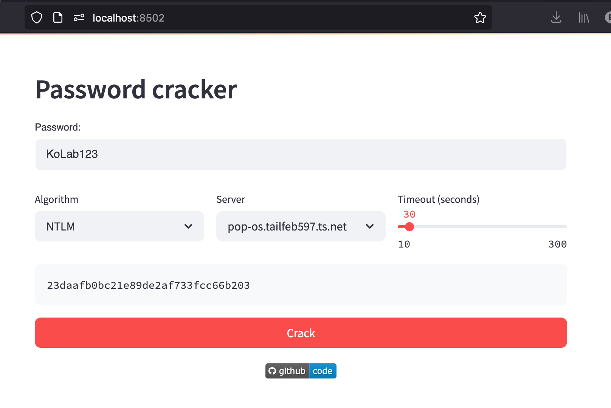

# 002 -- Veilige wachtwoorden / Safe passwords

This directory contains the slide deck and supporting material for the
Safe Passwords talk.


## Hashcat pw cracking UI

To demonstrate the ease of cracking weak password hashes with modern GPUs
live during the talk, `crack.py` contains a web-based UI on top of `hashcat`
implemented in [Streamlit](https://streamlit.io).



To run:

```
python3 -m venv ./venv
source ./venv/bin/activate
pip install -r requirements.txt
```

```
streamlit run ./crack.py
```

